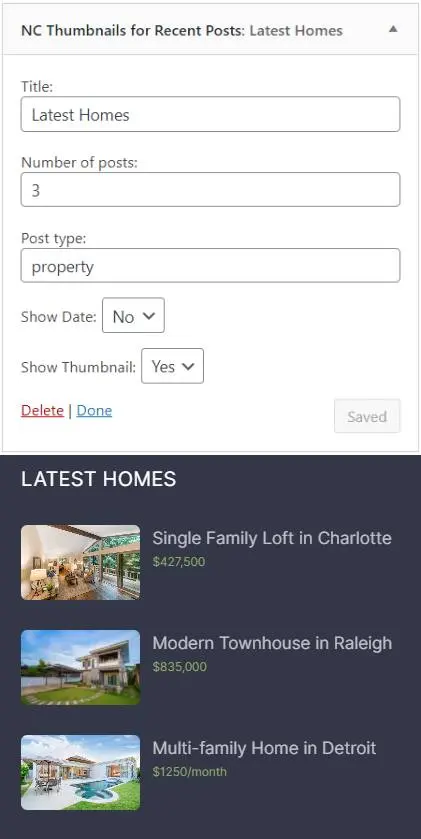

# About this plugin

**NC Thumbnails for Recent Posts** is a WordPress plugin that creates a new widget that allows you to display a thumbnail aside the latest post entries. You can also display posts from custom post types as well. Also: extendable with hooks.

**Problem:** the default Latest Posts WordPress widget doesn’t allow the featured image to display next to each entry. It also doesn’t give an option to display the latest posts from another post type.

**My solution:** My plugin uses the thumbnail files already generated and allows you to display the latest posts from a custom post type other than post. It also includes the standard options to show the date.

## How to use

1. Install the plugin and visit your Widgets screen 
2. Find the widget "NC Thumbnails for Recent Posts"
3. Add the widget to an area
4. Fill in the optional heading for the widget
5. Set the number of posts to display
6. Choose which post type to display (by default it's "post")
7. Choose whether to display the date
8. Choose whether to display a thumbnail next to each entry

Click "Save" if you're in the widget screen or "Publish" if you're editing widgets in Customizer.

## Extending the plugin

The plugin is also extendable with the following action hooks `nc_thumbnail_recent_posts_widget_before` and `nc_thumbnail_recent_posts_widget_after`. You can add something before and after the title of the latest posts. 

In the above image, you see I used the widget to display the latest homes from the property post type and instead of displaying the date, I hooked in display a price from a custom field.

Here’s some example code you would place in your `functions.php` file:

    function your_custom_function() {
      echo 'add your content here'; 
    } 
    add_action('nc_thumbnail_recent_posts_widget_after', 'your_custom_function');

## Customize the output

You can customize the widget's output with CSS custom properties (variables). Use your browser's inspector tools to learn more.

Here’s an example of what you can do. The below example styles the widget output within the HTML element with the ID of `megafooter`.

    #megafooter .nctrpsw {
      --image-gap: .75em /* the space between the image and entry title */;
      --image-border: none /* or solid 1px black */;
      --image-width: 95px /* the width of the image */;
      --image-height: 60px /* the height of the image */;
    }

.